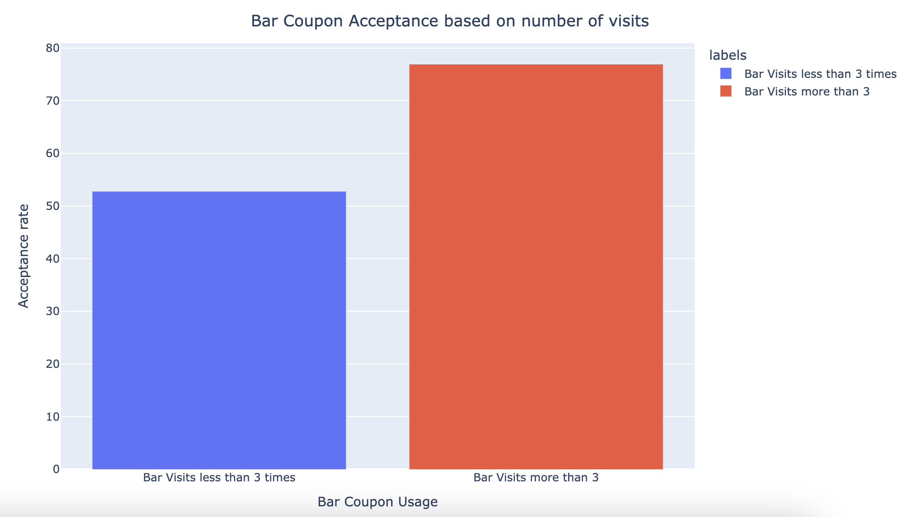
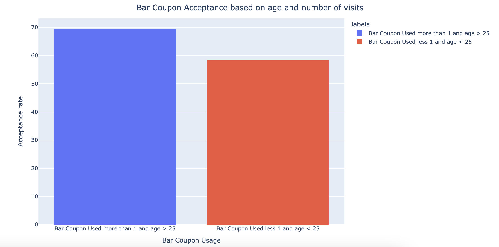
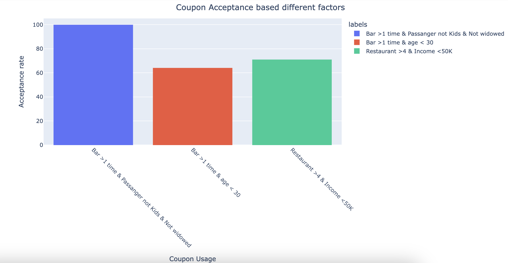
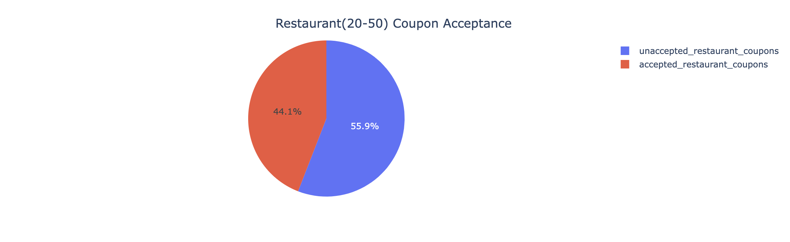
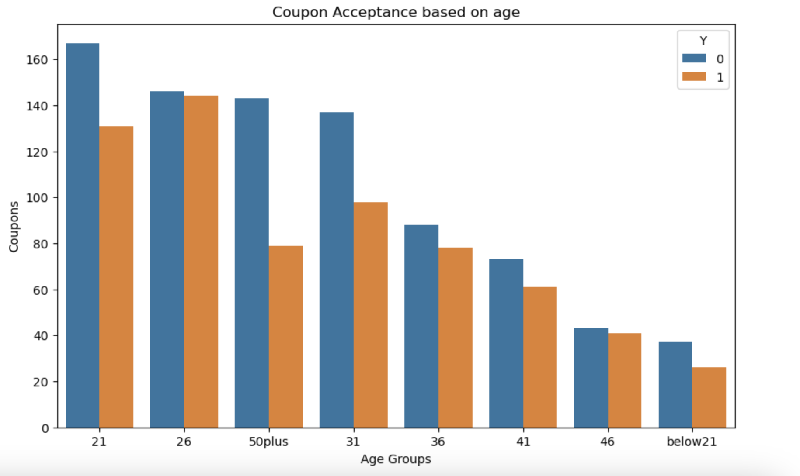
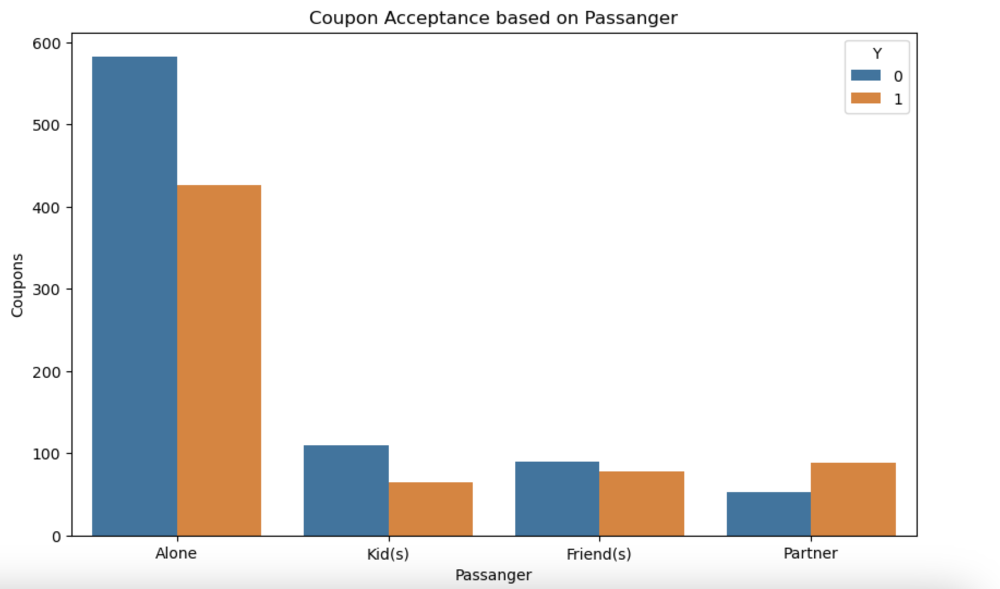
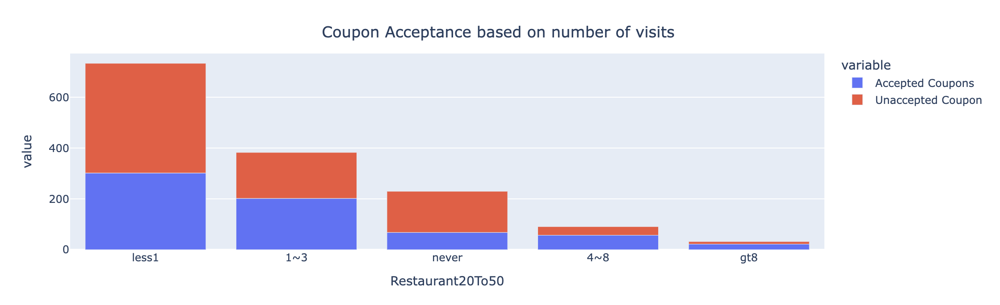

# Required Assignment 5.1: Will the Customer Accept the Coupon?

**Context**

Imagine driving through town and a coupon is delivered to your cell phone for a restaurant near where you are driving. Would you accept that coupon and take a short detour to the restaurant? Would you accept the coupon but use it on a subseqent trip? Would you ignorevre the coupon entirely? What if the coupon was for a bar instead of a restaurant? What about a coffee house? Would you accept a bar coupon with a minor passenger in the car? What about if it was just you and your partner in the car? Would weather impact the rate of acceptance? What about the time of day?

Obviously, proximity to the business is a factor on whether the coupon is delivered to the driver or not, but what are the factors that determine whether a driver accepts the coupon once it is delivered to them? How would you determine whether a driver is likely to accept a coupon?

## Jupyter Notebook Link
[Coupon Data](prompt.ipynb)

# Bar Coupon Analysis

## Overall Acceptance rate

### **_Conclusion_**:  
From the figure there are more people that are not accepting the coupons

## Acceptance rate based on number of visits

### **_Conclusion_**: 
People who visit the bar more than 3 times per month tend to have higher acceptance compared to people who use less than 3 times

## Acceptance rate based on number of visits and age

### **_Conclusion_**: 
People who are older than 25 and visit more than 1 time has higher acceptance compared to people who visit less than 1 and are under 25

## Acceptance rate based on passangers

### **_Conclusion_**: 
When there are no kids in the car there is higher acceptance rate compared to other scenarios

# Restaurant(20-50) Coupon Analysis

## Overall acceptance

### **_Conclusion_**: 
Less than 45% of acceptance chance when using restaurant coupons that are more expensive

## Acceptance by age

### **_Conclusion_**: 
People aged 26 have higher coupon usage and acceptance

## Acceptance based on passenger

### **_Conclusion_**: 
People with friends and partner will have higher acceptance

## Acceptance based on number of visits

### **_Conclusion_**: 
People who visit the restaurant 1 to 3 times a month tend to have higher acceptance